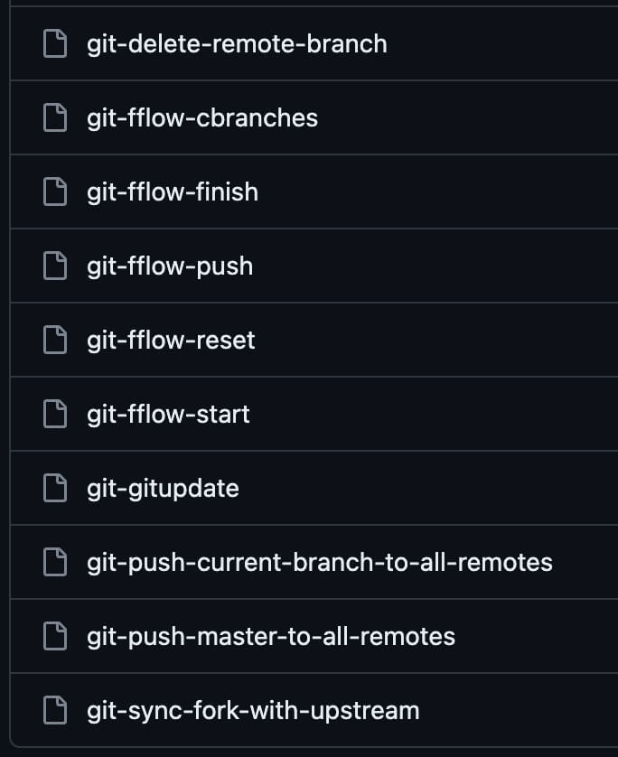

# SourceTree Custom Actions

The commands I'm using to complement SourceTree via Custom Actions



## Installation

Change your current directory to `$HOME/Library/Application Support/SourceTree/`:

```shell

# macos
cd "$HOME/Library/Application Support/SourceTree/"

# or, in Windows
# cd "%USERPROFILE%\AppData\Local\Atlassian\SourceTree\"
```

So, git clone (or download) this repository there:

```shell
git clone \
    https://github.com/rogeriopradoj/sourcetree-custom-actions-scripts.git \
    scripts
```

Then, go to SourceTree, `Preferences -> Custom Actions -> Add`, filling the options like this:

- **Menu Caption**: a custom name for that action;
- **[x] Show Full Ouput**: mark it;
- **Script to run**: navigate to `$HOME/Library/Application Support/SourceTree/scripts` folder (in macos or, in Windows, `%USERPROFILE%\AppData\Local\Atlassian\SourceTree\`) and pick the one you are setting up;

And it's done! Remember that you need to do this process to each of the scripts you want to use as a Custom Action in your machine.

### Updating

You can download latest zip, or run the following command:

```shell
# macos
CWD=`pwd` && \
    cd "$HOME/Library/Application Support/SourceTree/scripts" && \
    git pull && \
    cd $CWD

# or, in Windows
# set "CWD=%CD%" & cd /d "%USERPROFILE%\AppData\Local\Atlassian\SourceTree\scripts" & git pull & cd /d "%CWD%"
```

So, you get the latest versions of the scripts.

## Usage

While working in your repositories as normal in SourceTree, go to `Actions -> Custom Actions` and pick the one you want to use.

### Extra - Usage via CLI

I suggest you adding the folder `$HOME/Library/Application Support/SourceTree/scripts/bin` in your `$PATH` environment variable (in macos or, in Windows, `%USERPROFILE%\AppData\Local\Atlassian\SourceTree\` to `%PATH%`). This way, you can use the same scripts via CLI just calling script name, instead of needing to type the full path to each script.

In case you are using `bash` as your shell, you can do this:

```shell
echo \
    'export PATH=$PATH:"$HOME/Library/Application Support/SourceTree/scripts/bin"' \
    >> ~/.bashrc && \
    source ~/.bashrc
```

Otherwise, here is the syntax if your shell is `zsh`:

```shell
echo \
    'export PATH=$PATH:"$HOME/Library/Application Support/SourceTree/scripts/bin"' \
    >> ~/.zshrc && \
    source ~/.zshrc
```

Remember to make scripts executable:

```shell
find "$HOME/Library/Application Support/SourceTree/scripts/bin/" -type f -print0 | xargs -0 chmod +x
```

After that, you can run any of the scripts via CLI no matter inside what directory you are, example of running `git-push-master-to-all-remotes`

```shell
cd PATH_TO_ANY_GIT_PROJECT
#
git-push-master-to-all-remotes
# or
git push-master-to-all-remotes
```
